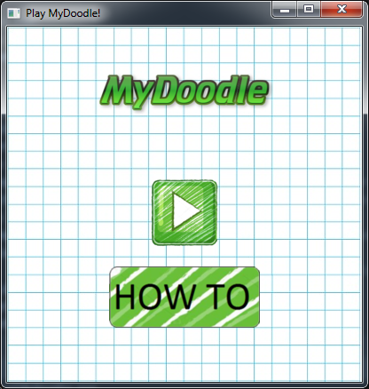
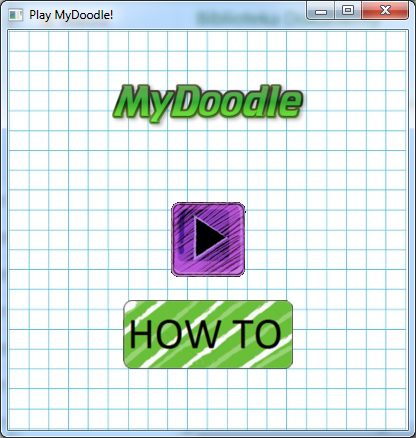
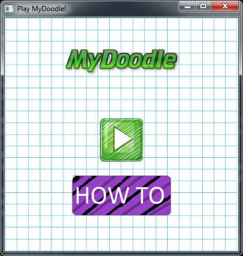
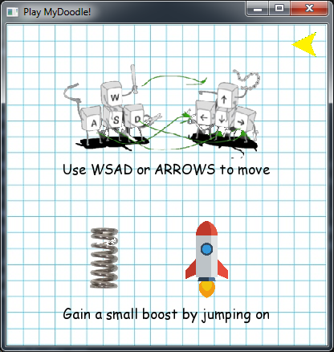
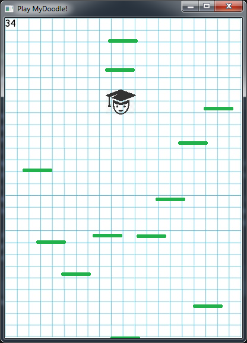
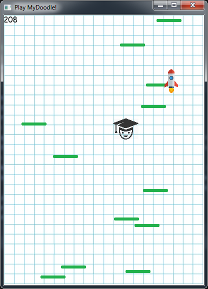
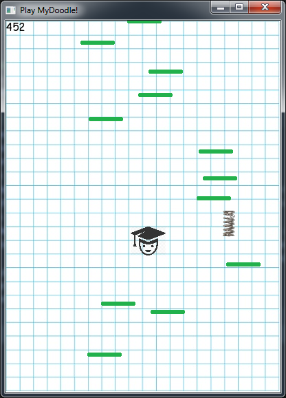
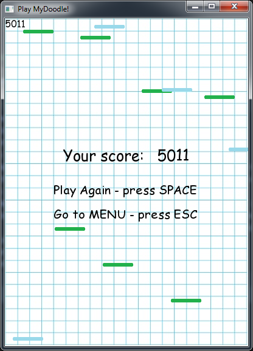

# MyDoodle

**[SFML Required]**

## Abstract 
View below is the original look of the project 

It was my third project in C++ and the last of my college projects in the semester, modeled on a popular Doodle Jump game.
This time, at the expense of design and primarily time, I tried to improve the quality of code. 
Aesthetics is the key, but it takes a hell of a lot of time. 
In this project I had pure freedom to choose the topic of the project, I chose to design a game in which I will use my newly acquired skills and learn new ones.
I designed a gravity-like mechanic that allows the character to jump and a collision mechanism that allows it to bounce off the platforms.
In addition, there are bonus items in the game that allow to quickly fly up, like rockets and springs. 

## Description 
The project consist of:
  * interactive menu:
    - a how-to advice 
  * game window
    - message text after lost:
      - score message with chance to play again
    
The game also includes soundtracks:
1. While jumping
2. Using boosters (different sounds for rocket and spring)
3. Losing

## Pictures of the game

